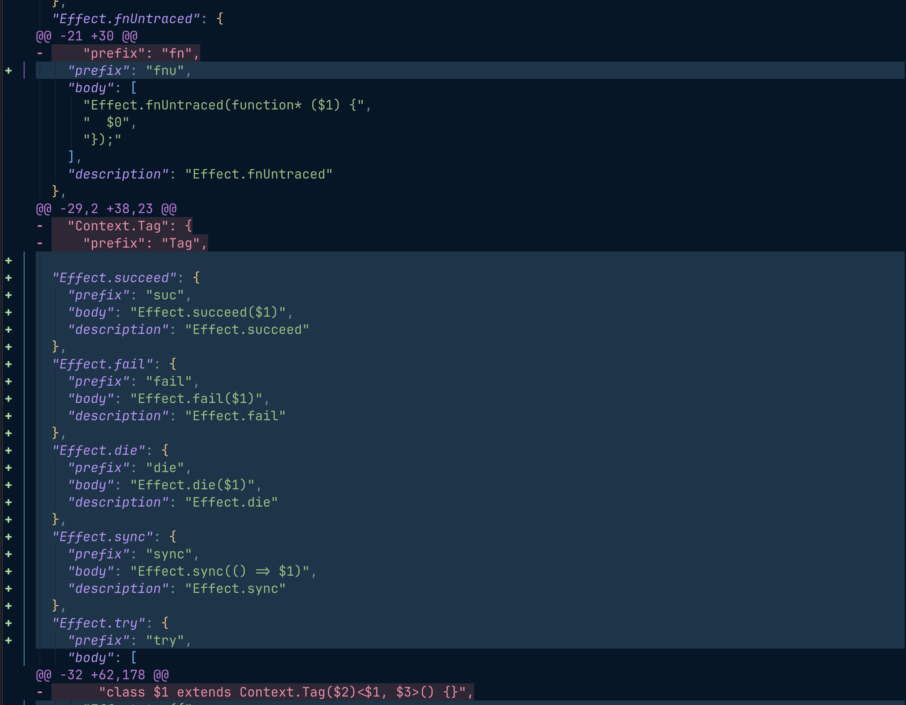

# lazydiff.nvim

Inline, lazygit-style unified diff overlay for the file you're editing.

Toggle `:Lazydiff` and the buffer turns into a Claude/lazygit-style view of
your uncommitted changes — deleted lines with `-`, added lines with `+`,
hunk headers in between — rendered in place via extmarks. No split, no
tab, no separate buffer.

Sometimes reading a diff inside lazygit is harder to scan than I'd like —
I wanted to see the change *in the file itself*, with the surrounding
code and indent intact, so it's obvious at a glance what actually moved.
And ideally still be able to edit while the diff is on screen.

This matters more now that AI writes so much of the code I'm reading.
When Claude hands me a 100-line patch, I want to actually look at it
before I commit — not skim a separate diff panel and hope. Seeing the
change inline, with the surrounding code and my own syntax highlighting
intact, makes it obvious at a glance what's moved and lets me fix the
bits I don't like without leaving the buffer.

A handful of existing Neovim plugins get close, but none quite hit
that mark, so this one does.



https://github.com/user-attachments/assets/ed8254bf-5cfb-4a07-8dc4-74a18003271f

Toggling the overlay, the auto-jump to the first hunk, and `]h` / `[h`
navigation in action.

## Status

Early development. v0.1: working tree vs `HEAD`, full-buffer overlay,
auto-refresh on save.

## Requirements

- Neovim ≥ 0.10 (uses `vim.diff` with `result_type = "indices"` and
  `vim.system`)
- `git` on `$PATH`

## Install

### lazy.nvim

```lua
{
  "rashedInt32/lazydiff.nvim",
  cmd = {
    "Lazydiff", "LazydiffOff", "LazydiffRefresh",
    "LazydiffNext", "LazydiffPrev", "LazydiffFirst",
  },
  config = function()
    require("lazydiff").setup()
  end,
}
```

### packer.nvim

```lua
use({
  "rashedInt32/lazydiff.nvim",
  config = function()
    require("lazydiff").setup()
  end,
})
```

## Commands

| Command            | What it does                                            |
| ------------------ | ------------------------------------------------------- |
| `:Lazydiff`        | Toggle the overlay on the current buffer                |
| `:LazydiffOff`     | Disable the overlay on the current buffer               |
| `:LazydiffRefresh` | Recompute the diff and re-render (also runs auto on save) |
| `:LazydiffNext`    | Jump to the next hunk                                   |
| `:LazydiffPrev`    | Jump to the previous hunk                               |
| `:LazydiffFirst`   | Jump to the first hunk                                  |

## Lua API

```lua
require("lazydiff").setup(opts)   -- merge opts on top of defaults
require("lazydiff").toggle(bufnr) -- bufnr defaults to current
require("lazydiff").enable(bufnr)
require("lazydiff").disable(bufnr)
require("lazydiff").refresh(bufnr)
require("lazydiff").goto_first(bufnr)
require("lazydiff").goto_next(bufnr)
require("lazydiff").goto_prev(bufnr)
```

## Defaults

```lua
require("lazydiff").setup({
  ref = "HEAD",                  -- ref to diff the working tree against
  signs = {
    add = "+ ",                  -- prefix on added lines (inline virt_text)
    delete = "- ",               -- prefix on virt_lines for deleted content
    context = "  ",
  },
  show_hunk_header = true,       -- show "@@ -a,b +c,d @@" between hunks
  read_only = false,             -- lock the buffer while overlay is on (off by default)
  auto_refresh = true,           -- refresh on BufWritePost / FileChangedShellPost
  live_refresh = true,           -- also refresh on TextChanged / TextChangedI
  debounce_ms = 100,             -- debounce window for live refresh
  jump_on_enable = true,         -- jump to the first hunk when toggling on
  nav = {
    wrap = true,                 -- ]h/[h wrap around at the last/first hunk
    center = true,               -- center the cursor (zz) after jumping
  },
})
```

### Writable mode (default)

The overlay is editable by default — the primary workflow this plugin
targets is reviewing an AI-generated patch and tweaking lines without
leaving diff view. While typing, the diff repaints automatically via a
debounced `TextChanged` listener (default 100 ms), and the `HEAD` blob
is fetched once per toggle and reused for every refresh, so live
updates don't shell out to git on every keystroke.

Two caveats to know about:

- Virtual deleted lines look like content but aren't part of the
  buffer — `dd` on one is a no-op. The line you actually want to
  delete is the buffer line, not the red preview above it.
- If you commit / checkout while the overlay is active, the cached
  baseline goes stale. Toggle off and on again to refresh it.

To get the lock-the-buffer / viewer-style behaviour instead, set
`read_only = true`. To disable the live repaint and only refresh on
save, set `live_refresh = false`.

## Highlight groups

All defined as `default = true` so your overrides win. Foreground and
background are pulled from `DiffAdd` / `DiffDelete` / `DiffChange` /
`Function` at setup time and re-applied on `ColorScheme` so theme
switches still work.

`LazydiffAdd` / `LazydiffChange` paint the in-buffer line via
`line_hl_group`, so they're **bg-only** — setting a fg there would
override treesitter / syntax colours on the added line. `LazydiffDelete`
colours virtual deleted lines (which have no syntax of their own), so
it carries both fg and bg.

| Group                | Default                                              |
| -------------------- | ---------------------------------------------------- |
| `LazydiffAdd`        | bg of `DiffAdd` (no fg, preserves syntax)            |
| `LazydiffChange`     | bg of `DiffChange` (no fg, preserves syntax)         |
| `LazydiffDelete`     | fg + bg of `DiffDelete`                              |
| `LazydiffAddSign`    | bold, fg + bg of `DiffAdd`                           |
| `LazydiffDeleteSign` | bold, fg + bg of `DiffDelete`                        |
| `LazydiffHunkHeader` | fg of `Function`, no background                      |

If you want fg-only (Claude-style) instead of the lazygit/`git diff`
look, override the bg to `NONE` after `setup()`:

```lua
vim.api.nvim_set_hl(0, "LazydiffAdd",    { fg = "#a6e3a1", bg = "NONE" })
vim.api.nvim_set_hl(0, "LazydiffDelete", { fg = "#f38ba8", bg = "NONE" })
```

## Suggested keymap

The plugin doesn't bind keys by default. A common choice:

```lua
vim.keymap.set("n", "<leader>dd", "<cmd>Lazydiff<cr>",     { desc = "Toggle lazydiff" })
vim.keymap.set("n", "]h",         "<cmd>LazydiffNext<cr>", { desc = "Next lazydiff hunk" })
vim.keymap.set("n", "[h",         "<cmd>LazydiffPrev<cr>", { desc = "Prev lazydiff hunk" })
```

Toggling the overlay on already lands the cursor on the first hunk (skipped
if you're already inside it). `]h` / `[h` walk the rest. We pick `]h`/`[h`
rather than `]d`/`[d` because the latter is Neovim's built-in diagnostic
motion — `]h`/`[h` matches the gitsigns convention.

## How it works

1. On toggle, lazydiff runs `git show HEAD:<relpath>` to fetch the
   committed version of the file.
2. The buffer contents and the committed blob are fed into `vim.diff`
   with `algorithm = "histogram"` and `ctxlen = 0`.
3. Hunk boundaries are normalized to strip equal leading/trailing lines.
4. The renderer paints, in a single namespace:
   - inline `virt_text` `+ ` prefixes on added lines, with
     `line_hl_group = LazydiffAdd` for fg-only line tinting,
   - `virt_lines_above` for deleted lines (`- ` prefix +
     `LazydiffDelete`),
   - a `@@ -a,b +c,d @@` virt_line above each hunk.
5. The buffer is set to `nomodifiable` while the overlay is active, so
   typos don't accidentally shred the diff. Toggle off to edit again.

## Why not just use…

| Plugin           | Why this still exists                                  |
| ---------------- | ------------------------------------------------------ |
| gitsigns.nvim    | gutter signs only; no inline deletion content          |
| mini.diff        | overlay tints whole lines; no `+`/`-` prefix           |
| diffview.nvim    | separate tabpage, side-by-side                         |
| unified.nvim     | ships with a mandatory file-tree explorer              |
| inline-diff.nvim | word-level strikethrough — different mental model      |

lazydiff is deliberately the smallest possible thing that gives you
lazygit's diff layout *in the file you're already editing*.

## License

MIT.
