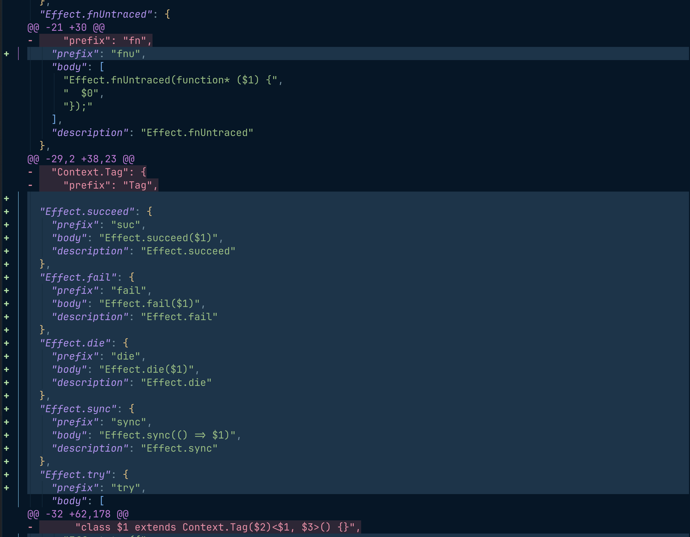
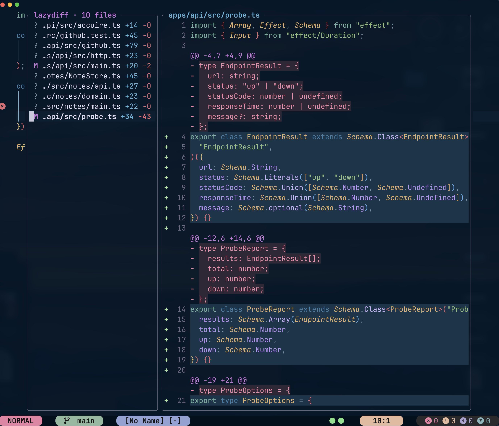

# lazydiff.nvim

Inline, lazygit-style unified diff overlay for the file you're editing.

Toggle `:Lazydiff` and the buffer turns into a Claude/lazygit-style view of
your uncommitted changes — deleted lines with `-`, added lines with `+`,
hunk headers in between — rendered in place via extmarks. No split, no
tab, no separate buffer.

Sometimes reading a diff inside lazygit is harder to scan than I'd like —
I wanted to see the change *in the file itself*, with the surrounding
code and indent intact, so it's obvious at a glance what actually moved.
And ideally still be able to edit while the diff is on screen.

This matters more now that AI writes so much of the code I'm reading.
When Claude hands me a 100-line patch, I want to actually look at it
before I commit — not skim a separate diff panel and hope. Seeing the
change inline, with the surrounding code and my own syntax highlighting
intact, makes it obvious at a glance what's moved and lets me fix the
bits I don't like without leaving the buffer.

A handful of existing Neovim plugins get close, but none quite hit
that mark, so this one does.

https://github.com/user-attachments/assets/ed8254bf-5cfb-4a07-8dc4-74a18003271f

Toggling the overlay, the auto-jump to the first hunk, and `]h` / `[h`
navigation in action.



## Status

Early development. v0.1: working tree vs `HEAD`, full-buffer overlay,
auto-refresh on save. v0.2 adds [float mode](#float-mode) — the same
overlay across every uncommitted file in a lazygit-style popup. v0.3 adds
word-level highlighting, hunk reset / yank, ref arguments, automatic
baseline refresh after commits, and folding of unchanged context in the
float.

## Requirements

- Neovim ≥ 0.10 (uses `vim.diff` with `result_type = "indices"` and
  `vim.system`)
- `git` on `$PATH`

Run `:checkhealth lazydiff` to confirm both.

## Install

### lazy.nvim

```lua
{
  "rashedInt32/lazydiff.nvim",
  cmd = {
    "Lazydiff", "LazydiffOff", "LazydiffRefresh",
    "LazydiffNext", "LazydiffPrev", "LazydiffFirst",
    "LazydiffReset", "LazydiffYank",
    "LazydiffFloat", "LazydiffFloatOff",
  },
  config = function()
    require("lazydiff").setup()
  end,
}
```

### packer.nvim

```lua
use({
  "rashedInt32/lazydiff.nvim",
  config = function()
    require("lazydiff").setup()
  end,
})
```

## Commands

| Command               | What it does                                                    |
| --------------------- | --------------------------------------------------------------- |
| `:Lazydiff [ref]`     | Toggle the overlay on the current buffer, optionally against `ref` |
| `:LazydiffOff`        | Disable the overlay on the current buffer                       |
| `:LazydiffRefresh`    | Refetch the baseline from git and re-render                     |
| `:LazydiffNext`       | Jump to the next hunk                                           |
| `:LazydiffPrev`       | Jump to the previous hunk                                       |
| `:LazydiffFirst`      | Jump to the first hunk                                          |
| `:LazydiffReset`      | Revert the hunk under the cursor to the baseline                |
| `:LazydiffYank [reg]` | Yank the hunk's deleted lines into a register (default `"`)     |
| `:LazydiffFloat [ref]`| Toggle the float over **every** changed file, optionally against `ref` |
| `:LazydiffFloatOff`   | Close the float                                                 |

`ref` completes against branches and tags. `:Lazydiff main` reviews the
buffer against `main`; running it again with the same ref turns the overlay
off, and a bare `:Lazydiff` turns off whatever ref is active.

## Reviewing a patch

The overlay is editable, so the review loop is: read the hunk, fix what
you don't like in place, or reject it outright.

- `:LazydiffReset` on a hunk puts the baseline's lines back. On an added
  block it deletes the block; on a deleted block it reinserts the red lines.
- `:LazydiffYank` copies the red lines — which `y` can't reach, since they're
  virtual — into a register, linewise.
- Changed words inside a change hunk are emphasised (`word_diff`), so a
  one-token edit on a long line is spotted without reading the whole line.

You can also toggle the overlay on a file that has no changes yet. It stays
armed and paints as soon as you type.

## Float mode

`:Lazydiff` answers "what changed in *this* file." `:LazydiffFloat` answers
"what changed *everywhere*" — a lazygit-style popup with every uncommitted
file on the left and the selected one on the right, rendered full-length
with the same overlay.

https://github.com/user-attachments/assets/e6998ac5-1ca5-43c1-8f42-be4e75b04235

Opening the float, moving through the file list, and jumping into a file
with `<CR>`.



Moving the cursor in the sidebar renders that file on the right. `<CR>`
closes the float and opens the real file with the inline overlay on, at
the line you were looking at.

The list covers everything differing from `ref` in the working tree, plus
untracked files. It's a **snapshot** — nothing auto-refreshes, so the list
can't reorder while you're reading it. Press `R` to pick up changes made
behind the float; your selection is restored by path, not by row.

The review pane is read-only. Renames are listed once, under their new
path; binary files show a placeholder instead of garbage. `<Tab>` folds
everything except the hunks and a few lines of context around them, which
is the lazygit view of a long file with a small change.

| Key           | In the sidebar          | In the review pane     |
| ------------- | ----------------------- | ---------------------- |
| `j` / `k`     | select file             | move                   |
| `<CR>`        | open file, close float  | open file, close float |
| `]h` / `[h`   | —                       | next / previous hunk   |
| `]f` / `[f`   | next / previous file    | next / previous file   |
| `<Tab>`       | fold unchanged context  | fold unchanged context |
| `R`           | refresh                 | refresh                |
| `<C-l>`       | focus review pane       | —                      |
| `<C-h>`       | —                       | focus sidebar          |
| `q` / `<Esc>` | close                   | close                  |

## Lua API

```lua
require("lazydiff").setup(opts)          -- merge opts on top of defaults
require("lazydiff").toggle(bufnr, ref)   -- bufnr defaults to current; ref optional
require("lazydiff").enable(bufnr, ref)
require("lazydiff").disable(bufnr)
require("lazydiff").refresh(bufnr, { baseline = true })  -- refetch from git first
require("lazydiff").is_enabled(bufnr)
require("lazydiff").goto_first(bufnr)
require("lazydiff").goto_next(bufnr)
require("lazydiff").goto_prev(bufnr)
require("lazydiff").reset_hunk(bufnr)
require("lazydiff").yank_hunk(bufnr, register)
require("lazydiff").status(bufnr)        -- { ref, hunks, current } or nil
require("lazydiff").statusline(bufnr)    -- "lazydiff: hunk 2/5" or ""

require("lazydiff").toggle_float({ ref = "main" })
require("lazydiff").open_float({ ref = "main" })
require("lazydiff").close_float()
```

`statusline()` is meant for a statusline component:

```lua
-- lualine
sections = { lualine_x = { function() return require("lazydiff").statusline() end } }
```

## Defaults

```lua
require("lazydiff").setup({
  ref = "HEAD",                  -- ref to diff the working tree against
  signs = {
    add = "+",                   -- sign-column marker on added lines (max 2 cells)
    delete = "- ",               -- prefix on virt_lines for deleted content
  },
  show_hunk_header = true,       -- show "@@ -a,b +c,d @@" between hunks
  word_diff = true,              -- emphasise changed words inside change hunks
  read_only = false,             -- lock the buffer while overlay is on (off by default)
  auto_refresh = true,           -- refresh on BufWritePost / FileChangedShellPost / BufReadPost
  live_refresh = true,           -- also refresh on TextChanged / TextChangedI
  debounce_ms = 100,             -- debounce window for live refresh
  watch_git = true,              -- refetch the baseline when HEAD or the index change
  force_signcolumn = true,       -- turn signcolumn on while the overlay is active
  jump_on_enable = true,         -- jump to the first hunk when toggling on
  nav = {
    wrap = true,                 -- ]h/[h wrap around at the last/first hunk
    center = true,               -- center the cursor (zz) after jumping
  },
  float = {                      -- :LazydiffFloat
    width = 0.9,                 -- fraction of the editor (> 1 = absolute columns)
    height = 0.9,                -- fraction of the editor (> 1 = absolute lines)
    sidebar = 0.3,               -- fraction of the float's width (> 1 = absolute columns)
    border = "rounded",
    title = " lazydiff ",
    number = true,               -- line numbers in the review pane
    select_debounce_ms = 40,     -- let the cursor settle before rendering a file
    fold_context = false,        -- start with unchanged regions folded
    context_lines = 3,           -- lines kept visible around each hunk when folded
    keys = {
      close = { "q", "<Esc>" },
      refresh = "R",
      open_file = "<CR>",
      next_hunk = "]h",
      prev_hunk = "[h",
      next_file = "]f",
      prev_file = "[f",
      toggle_fold = "<Tab>",
      focus_list = "<C-h>",
      focus_pane = "<C-l>",
    },
  },
})
```

`setup()` validates option types and raises on a mismatch, so a typo like
`float = { width = "0.9" }` fails loudly instead of rendering oddly.

### Writable mode (default)

The overlay is editable by default — the primary workflow this plugin
targets is reviewing an AI-generated patch and tweaking lines without
leaving diff view. While typing, the diff repaints automatically via a
debounced `TextChanged` listener (default 100 ms). The baseline blob is
fetched once per toggle and reused for every keystroke, so live updates
don't shell out to git while you type.

The baseline is refetched when it's likely to have moved: on save, on
`:e!`, and — with `watch_git` — whenever HEAD or the index change, so a
commit or checkout made from a terminal shows up within a moment.
`:LazydiffRefresh` forces it.

One caveat: virtual deleted lines look like content but aren't part of the
buffer — `dd` on one is a no-op. Use `:LazydiffReset` to put them back, or
`:LazydiffYank` to copy them.

To get the lock-the-buffer / viewer-style behaviour instead, set
`read_only = true`. To disable the live repaint and only refresh on
save, set `live_refresh = false`.

## Highlight groups

All defined as `default = true` so your overrides win. Colours are pulled
from `DiffAdd` / `DiffDelete` / `Function` / `Normal` at setup time and
re-applied on `ColorScheme` so theme switches still work.

`LazydiffAdd` paints the in-buffer line via `hl_group` + `hl_eol`, so it's
**bg-only** — setting a fg there would override treesitter / syntax colours
on the added line. `LazydiffDelete` colours virtual deleted lines (which
have no syntax of their own), so it carries both fg and bg. The `*Word`
groups are a stronger shade of the line band; on schemes where `DiffAdd`
has no background they fall back to bold + underline.

| Group                | Default                                              |
| -------------------- | ---------------------------------------------------- |
| `LazydiffAdd`        | bg of `DiffAdd` (no fg, preserves syntax)            |
| `LazydiffDelete`     | fg + bg of `DiffDelete`                              |
| `LazydiffAddWord`    | bold, `LazydiffAdd` bg blended toward `Normal` fg    |
| `LazydiffDeleteWord` | bold, `LazydiffDelete` bg blended toward `Normal` fg |
| `LazydiffAddSign`    | bold, fg of `DiffAdd`, bg of `Normal`                |
| `LazydiffDeleteSign` | bold, fg of `DiffDelete`, bg of `Normal`             |
| `LazydiffHunkHeader` | fg of `Function`, no background                      |

Float mode adds the groups below. These are fg-only text in the sidebar, so
they source from `Added` / `Removed` / `Changed` first (which carry a
foreground in most colorschemes) and fall back to `DiffAdd` / `DiffDelete` /
`DiffChange`, which are frequently bg-only.

| Group                       | Default                                  |
| --------------------------- | ---------------------------------------- |
| `LazydiffStatusModified`    | fg of `Changed` / `GitSignsChange`       |
| `LazydiffStatusAdded`       | fg of `Added` / `GitSignsAdd`            |
| `LazydiffStatusDeleted`     | fg of `Removed` / `GitSignsDelete`       |
| `LazydiffStatusRenamed`     | fg of `Function`                         |
| `LazydiffStatusUntracked`   | fg of `Comment`                          |
| `LazydiffCountAdd`          | fg of `Added`                            |
| `LazydiffCountDelete`       | fg of `Removed`                          |
| `LazydiffFloatPath`         | fg of `Normal`                           |
| `LazydiffFloatDim`          | fg of `Comment`                          |
| `LazydiffFloatTitle`        | bold, fg of `Function`                   |
| `LazydiffFloatSelected`     | bg of `CursorLine` / `Visual`, bold      |
| `LazydiffFold`              | fg of `Comment` (folded-context lines)   |

If you want fg-only (Claude-style) instead of the lazygit/`git diff`
look, override the bg to `NONE` after `setup()`:

```lua
vim.api.nvim_set_hl(0, "LazydiffAdd",    { fg = "#a6e3a1", bg = "NONE" })
vim.api.nvim_set_hl(0, "LazydiffDelete", { fg = "#f38ba8", bg = "NONE" })
```

## Suggested keymap

The plugin doesn't bind keys by default. A common choice:

```lua
vim.keymap.set("n", "<leader>dd", "<cmd>Lazydiff<cr>",      { desc = "Toggle lazydiff" })
vim.keymap.set("n", "<leader>dD", "<cmd>LazydiffFloat<cr>", { desc = "Lazydiff float (all changes)" })
vim.keymap.set("n", "<leader>dr", "<cmd>LazydiffReset<cr>", { desc = "Revert hunk under cursor" })
vim.keymap.set("n", "]h",         "<cmd>LazydiffNext<cr>",  { desc = "Next lazydiff hunk" })
vim.keymap.set("n", "[h",         "<cmd>LazydiffPrev<cr>",  { desc = "Prev lazydiff hunk" })
```

Toggling the overlay on already lands the cursor on the first hunk (skipped
if you're already inside it). `]h` / `[h` walk the rest. We pick `]h`/`[h`
rather than `]d`/`[d` because the latter is Neovim's built-in diagnostic
motion — `]h`/`[h` matches the gitsigns convention.

## Tests

```bash
tests/run.sh          # build fixtures, run, clean up
KEEP=1 tests/run.sh   # leave the fixture repos behind to poke at
```

No test framework and no dependencies — a headless Neovim (`nvim -l`) driving
the plugin against throwaway git repos built by `tests/fixture.sh`. The fixture
has one file per case the float has to survive: modified, deleted, renamed,
untracked, untracked binary, tracked binary, a path containing a space, one
unchanged file that must *not* show up, and a second commit so `HEAD~1` is a
real ref.

The load-bearing assertion is that hunks rendered in float mode are identical
(kind and all four offsets) to hunks rendered by `:Lazydiff` on the same file
opened normally — the two paths share `diff.compute` and `render.render`, and
the suite exists to keep them from drifting.

CI runs the suite plus `stylua --check` and `luacheck` on every push.

## How it works

1. On toggle, lazydiff runs `git show <ref>:<relpath>` to fetch the
   committed version of the file.
2. The buffer contents and the committed blob are fed into `vim.diff`
   with `algorithm = "histogram"` and `ctxlen = 0`.
3. Hunk boundaries are normalized to strip equal leading/trailing lines.
4. For change hunks whose lines pair up, each pair is tokenised and diffed
   again to find the changed words.
5. The renderer paints, in a single namespace:
   - a `+` sign in the sign column plus `LazydiffAdd` across the line for
     added lines, with `LazydiffAddWord` on changed spans,
   - `virt_lines_above` for deleted lines (`- ` prefix + `LazydiffDelete`,
     with `LazydiffDeleteWord` on changed spans),
   - a `@@ -a,b +c,d @@` virt_line above each hunk.
6. Autocmds keep it current: a debounced repaint while typing, a baseline
   refetch on save / reload, and a watcher on the git directory that
   refetches after commits and checkouts.

## Why not just use…

| Plugin           | Why this still exists                                  |
| ---------------- | ------------------------------------------------------ |
| gitsigns.nvim    | gutter signs only; no inline deletion content          |
| mini.diff        | overlay tints whole lines; no `+`/`-` prefix           |
| diffview.nvim    | separate tabpage, side-by-side                         |
| unified.nvim     | ships with a mandatory file-tree explorer              |
| inline-diff.nvim | word-level strikethrough — different mental model      |

lazydiff is deliberately the smallest possible thing that gives you
lazygit's diff layout *in the file you're already editing*.

## License

MIT.
